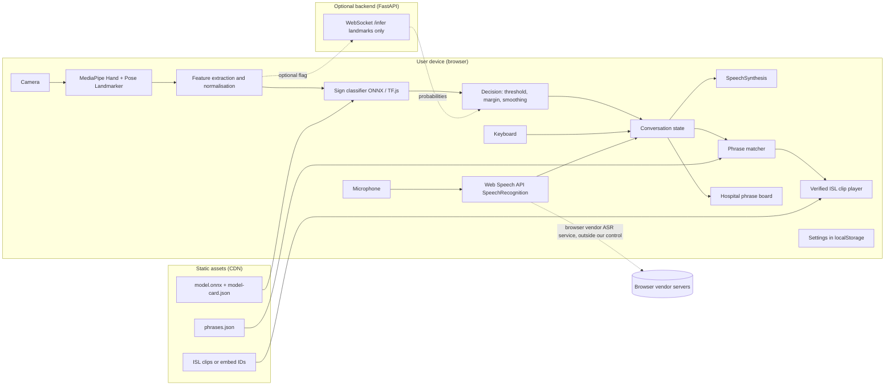
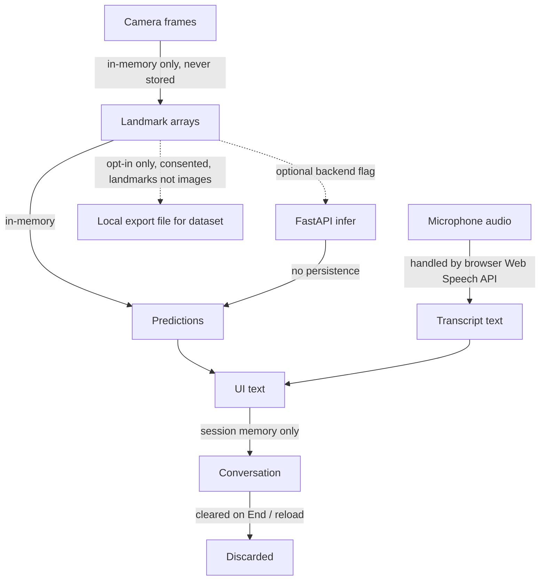
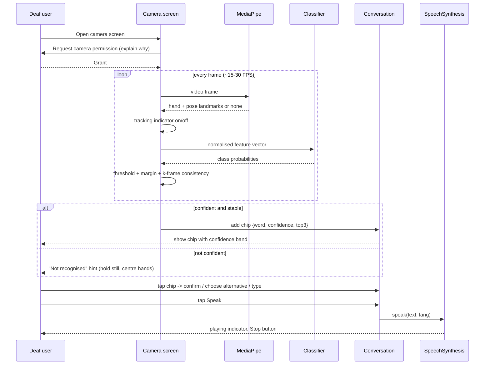
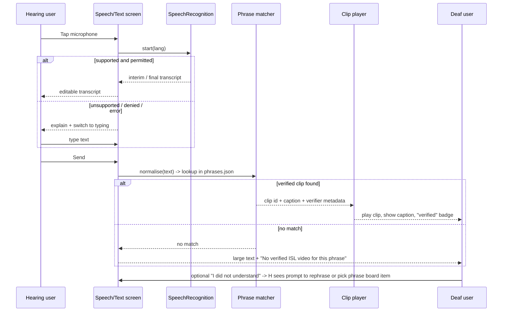

# Technical Architecture

## 1. Technology stack (recommendation)

| Layer | Choice | Why it is needed | Alternatives considered |
|---|---|---|---|
| Frontend framework | **Next.js (App Router) + React + TypeScript** | Component model for a multi-screen app; TypeScript catches contract errors between landmark, model and UI code; static export for free hosting | Vite + React (lighter; fine if Next's server features are never used) |
| Styling | **Tailwind CSS** | Fast iteration on large-text, high-contrast, responsive layouts; utility classes make accessibility tokens (focus rings, min sizes) consistent | CSS Modules |
| Vision | **@mediapipe/tasks-vision** (Hand Landmarker, Pose Landmarker) + `getUserMedia` | On-device landmark extraction; the only practical way to get hand geometry in the browser without sending frames anywhere | TensorFlow.js HandPose (older, less accurate) |
| In-browser inference | **ONNX Runtime Web** (for sklearn models via `skl2onnx`) or **TensorFlow.js** (for Keras MLP/GRU) | Runs the trained classifier locally with low latency | Hand-rolled JS for RF/MLP (viable for tiny models) |
| ML training | **Python 3.11, NumPy, scikit-learn, PyTorch (only if temporal model is pursued)**, Jupyter for exploration | Fast experimentation; scikit-learn suffices for static signs; PyTorch for sequence models | Keras/TensorFlow (simpler TF.js export path) |
| Optional backend | **FastAPI** with WebSocket endpoint accepting landmark arrays | Fallback if browser inference is too slow on target devices; also useful for a data-collection tool | None (browser-only) |
| Speech | **Web Speech API** (`SpeechRecognition`, `SpeechSynthesis`) | Zero-cost, no server, adequate for demo; typing fallback covers unsupported browsers | Server ASR (Whisper) if Web Speech is unusable |
| Storage | **None by default**; `localStorage` only for settings; static JSON for phrases and clip metadata | Requirements do not need a database; avoiding one removes privacy and ops burden | SQLite/Postgres only if user accounts or multi-device history are ever required |
| Hosting | **GitLab Pages / Vercel / Netlify** for static frontend; **Render / Fly.io / Railway** free tier for optional backend | Free, HTTPS by default (needed for camera/mic) | |
| CI | **GitLab CI**: lint, type-check, unit tests, build, model evaluation report | Reproducibility and quality gates | |

`DECISION NEEDED` Next.js vs Vite. Next.js is recommended for familiarity and deployment ecosystem, but Vite is lighter if the team prefers.

## 2. High-level system architecture



## 3. Data-flow diagram (privacy view)



Defaults: no frames stored, no audio stored, no server persistence. See `privacy-and-safety.md`.

## 4. Sequence: Sign-to-Text and Sign-to-Speech



## 5. Sequence: Speech/Text to Visual ISL



## 6. Error handling and fallback flows

| Situation | Detection | User-facing behaviour | Fallback |
|---|---|---|---|
| Camera permission denied | `getUserMedia` rejects `NotAllowedError` | Full-screen state explaining how to re-enable; no dead end | Phrase board and typing remain available |
| No camera device | `NotFoundError` | Message; hide camera features | Phrase board |
| Camera in use elsewhere | `NotReadableError` | Message with retry | Phrase board |
| Insecure context (HTTP) | `navigator.mediaDevices` undefined | Message: open via HTTPS | None (deployment must use HTTPS) |
| MediaPipe fails to load (WASM blocked, slow network) | Promise rejection / timeout | Message; retry button | Phrase board |
| Low FPS (< 8) | Measured frame timing | Banner: "Running slowly, try closing other apps"; reduce resolution | Optional backend inference flag |
| Hands not detected | Empty landmark list for > 1 s | Tracking indicator red; hint overlay | |
| Low confidence | Below threshold or margin | "Not recognised"; after 2 consecutive failures, suggest phrase board | Phrase board, typing |
| Wrong prediction | User taps chip | Top-3 alternatives + type | |
| Mic permission denied | `SpeechRecognition` error `not-allowed` | Message; switch to typing | Typing |
| ASR unsupported (Firefox) | `window.SpeechRecognition` undefined | Message on first use; typing shown by default | Typing |
| ASR `network` / `no-speech` | Error events | Inline error with retry | Typing |
| TTS no voice for language | `getVoices()` empty for lang | Notice; use default voice or show text only | Large text |
| Clip fails to load | `<video>` error event | Show caption text + "video unavailable" | Text |
| Backend (if enabled) unreachable | WebSocket close/timeout | Auto-switch to browser inference with notice | Browser inference |

## 7. Frontend module layout (proposed, not yet created)

```
app/                      Next.js routes: /, /talk, /camera, /speak, /phrases, /settings, /help
components/               UI components (ConversationView, SignChip, ConfidenceBadge, ClipPlayer, PhraseBoard, PermissionState)
lib/vision/               camera.ts, landmarker.ts, features.ts (normalisation), decision.ts (threshold/smoothing)
lib/model/                loader.ts (ONNX/TF.js), predict.ts, model-card.json
lib/speech/               asr.ts, tts.ts with capability detection
lib/phrases/              phrases.json, matcher.ts, schema.ts
lib/state/                conversation store (in-memory), settings (localStorage)
public/clips/             verified ISL clips or embed manifest
ml/                       Python: collect/, features/, train/, eval/, export/ (separate from web app)
docs/                     this directory
```

## 8. Data contracts

**Feature vector (browser -> model):** `Float32Array` of fixed length documented in `model-card.json` (`input_dim`, `landmark_order`, `normalisation_version`). The Python feature code and the TypeScript feature code must implement the same normalisation; a shared JSON test fixture (landmarks in, features out) is used to verify parity in CI.

**Prediction:** `{ label: string, probability: number, top3: [{label, probability}], accepted: boolean, reason?: 'low_confidence' | 'low_margin' | 'unstable' | 'no_hands' }`

**phrases.json entry:**
```json
{
  "id": "pain_chest",
  "category": "pain",
  "text_en": "I have chest pain",
  "text_hi": "",
  "aliases_en": ["chest pain", "my chest hurts"],
  "isl_gloss": "",
  "clip": { "type": "file|youtube", "src": "" },
  "validation": { "status": "draft|expert_verified", "verified_by": "", "date": "" },
  "licence": ""
}
```

**Optional backend:** `WS /infer` receives `{ features: number[], model_version: string }` and returns the Prediction object. No logging of payloads.

## 9. Deployment

- Frontend: static export, deployed by GitLab CI to GitLab Pages (HTTPS provided). Model and phrases are static assets with cache-busting hashes.
- Backend (optional): Docker image built in CI, deployed to a free-tier host; health endpoint; environment flag in frontend to enable.
- Demo insurance: also run the frontend locally (`localhost` counts as a secure context) in case hosting is down.
